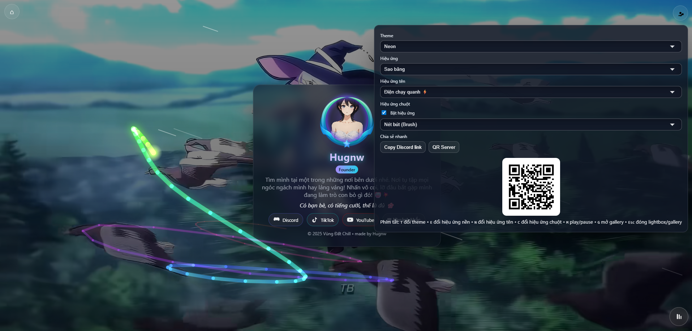

<!-- Language Switch -->
<p align="right">
  <a href="#en">English</a> | <a href="#vi">Tiếng Việt</a>
</p>

<a id="en"></a>

# Hugnw — Personal Profile Page



A minimal, animated personal landing page with background video, theme/effects switcher, music player, quick settings, and a modal photo gallery.

- URL entry point: `index.html`
- Main files: `index.html`, `profile.css`, `profile.js`, `media/`

<!-- Badges -->


## Features
- Background video with overlay and noise effects
- Interactive avatar and animated name effects (fire/neon/electric)
- Theme presets: Auto, Dark, Neon, Pastel, Cyberpunk, Retro
- Background visual effects: Snow, Rain, Leaves, Fireworks, Shooting Stars, Bubbles, Combo, Off
- Cursor effects toggle and modes
- Audio player with small UI and playlist support
- Quick settings panel and share helpers (copy Discord link, QR)
- Modal photo gallery with lightbox
- Keyboard shortcuts for quick control

## Keyboard Shortcuts
- T: Change theme
- E: Change background effect
- N: Change name effect
- C: Toggle cursor effect
- M: Play/Pause music
- G: Open gallery
- Esc: Close lightbox/gallery

## Getting Started
1. Clone or download this repository.
2. Open `index.html` directly in a modern browser.
   - For full media autoplay support, ensure the browser allows muted autoplay.
3. Put your media under `media/` if you customize.

## Customize
- Texts, links, and labels: edit `index.html`
- Styles, themes, animations: edit `profile.css`
- Behaviors, effects, playlist, gallery logic: edit `profile.js`
- Assets: `media/` (video bg, images, audio, gallery)

## Live Demo
- GitHub Pages: enable Pages in repo settings (branch: `main`, folder: `/root`), then share the generated URL.

## Folder Structure
```
.
├─ index.html
├─ profile.css
├─ profile.js
├─ media/
│  ├─ avatar.jpg
│  ├─ bg.mp4
│  ├─ bgm.mp3
│  ├─ bia.gif
│  ├─ deco.png
│  ├─ poster.jpg
│  └─ gallery/
└─ LICENSE
```

## Deployment
- GitHub Pages: Settings → Pages → Branch `main` → Root. Wait 1–2 minutes.
- Netlify/Vercel: create a new site from this repo. Build command: none. Publish directory: root.

## Notes
- Repo language defaults to Vietnamese content in `index.html` (`<html lang="vi">`).
- Open Graph preview image is `media/poster.jpg`. Update if needed.
- Background video sources: `media/bg.webm` and `media/bg.mp4`.

## License
This project is licensed under the MIT License — see [LICENSE](LICENSE) for details.

---

<p align="right">
  <a href="#vi">Chuyển sang Tiếng Việt</a>
</p>

<a id="vi"></a>

# Hugnw — Trang cá nhân


Trang đích cá nhân tối giản, giàu hiệu ứng với video nền, đổi theme/hiệu ứng, trình phát nhạc, bảng cài đặt nhanh và gallery ảnh dạng modal.

- File mở: `index.html`
- Thành phần chính: `index.html`, `profile.css`, `profile.js`, `media/`

<!-- Badges -->


## Tính năng
- Video nền với lớp tối và hiệu ứng noise
- Avatar tương tác và hiệu ứng tên (lửa/neon/điện)
- Theme có sẵn: Auto, Dark, Neon, Pastel, Cyberpunk, Retro
- Hiệu ứng nền: Tuyết, Mưa, Lá rơi, Pháo hoa, Sao băng, Bong bóng, Combo, Tắt
- Bật/tắt hiệu ứng con trỏ chuột và chọn chế độ
- Trình phát nhạc gọn nhẹ, hỗ trợ playlist
- Bảng cài đặt nhanh và tiện ích chia sẻ (copy Discord, QR)
- Gallery ảnh dạng modal kèm lightbox
- Nhiều phím tắt thao tác nhanh

## Phím tắt
- T: Đổi theme
- E: Đổi hiệu ứng nền
- N: Đổi hiệu ứng tên
- C: Bật/tắt hiệu ứng chuột
- M: Play/Pause nhạc nền
- G: Mở gallery
- Esc: Đóng lightbox/gallery

## Live Demo
- GitHub Pages: bật Pages trong cài đặt repo (nhánh `main`, thư mục `/root`), sau đó dùng URL được tạo.

## Cấu trúc thư mục
```
.
├─ index.html
├─ profile.css
├─ profile.js
├─ media/
│  ├─ avatar.jpg
│  ├─ bg.mp4
│  ├─ bgm.mp3
│  ├─ bia.gif
│  ├─ deco.png
│  ├─ poster.jpg
│  └─ gallery/
└─ LICENSE
```

## Triển khai
- GitHub Pages: Settings → Pages → Branch `main` → Root. Chờ 1–2 phút.
- Netlify/Vercel: tạo site mới từ repo. Build command: không. Publish directory: root.

## Bắt đầu
1. Clone hoặc tải repo này.
2. Mở trực tiếp `index.html` bằng trình duyệt hiện đại.
   - Để tự động phát media mượt hơn, bật quyền autoplay (muted) nếu cần.
3. Thay nội dung/asset theo ý bạn trong thư mục `media/`.

## Tùy biến
- Nội dung, liên kết, nhãn: chỉnh trong `index.html`
- Giao diện, theme, animation: chỉnh trong `profile.css`
- Hành vi, hiệu ứng, playlist, gallery: chỉnh trong `profile.js`
- Tài nguyên: `media/` (video nền, ảnh, nhạc, gallery)

## Ghi chú
- Ngôn ngữ mặc định của trang là Tiếng Việt (`<html lang="vi">`).
- Hình xem trước (Open Graph) dùng `media/poster.jpg`. Thay nếu cần.
- Video nền: `media/bg.webm` và `media/bg.mp4`.

## Giấy phép
Dự án này được phân phối theo giấy phép MIT — xem [LICENSE](LICENSE) để biết chi tiết.
