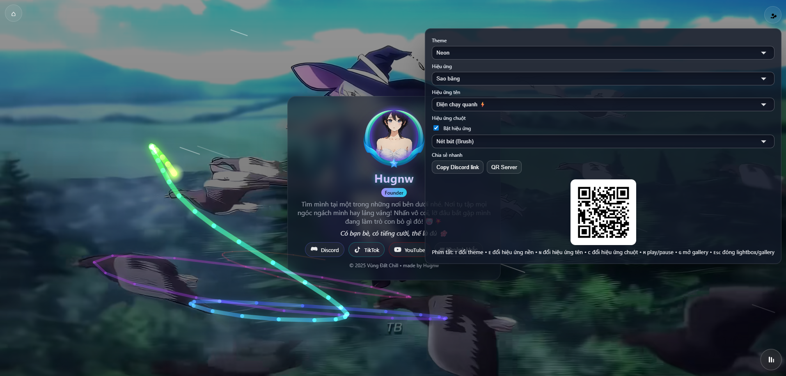

<p align="right">
  <a href="README.md">English</a>
</p>

# Hugnw — Trang cá nhân



Trang đích cá nhân tối giản, giàu hiệu ứng với video nền, đổi theme/hiệu ứng, trình phát nhạc, bảng cài đặt nhanh và gallery ảnh dạng modal.

- File mở: `index.html`
- Thành phần chính: `index.html`, `profile.css`, `profile.js`, `media/`

<!-- Badges -->


## Tính năng
- Video nền với lớp tối và hiệu ứng noise
- Avatar tương tác và hiệu ứng tên (lửa/neon/điện)
- Theme có sẵn: Auto, Dark, Neon, Pastel, Cyberpunk, Retro
- Hiệu ứng nền: Tuyết, Mưa, Lá rơi, Pháo hoa, Sao băng, Bong bóng, Combo, Tắt
- Bật/tắt hiệu ứng con trỏ chuột và chọn chế độ
- Trình phát nhạc gọn nhẹ, hỗ trợ playlist
- Bảng cài đặt nhanh và tiện ích chia sẻ (copy Discord link, QR)
- Gallery ảnh dạng modal kèm lightbox
- Nhiều phím tắt thao tác nhanh

## Phím tắt
- T: Đổi theme
- E: Đổi hiệu ứng nền
- N: Đổi hiệu ứng tên
- C: Bật/tắt hiệu ứng chuột
- M: Play/Pause nhạc nền
- G: Mở gallery
- Esc: Đóng lightbox/gallery

## Live Demo
- Live Demo: https://boyherokt.github.io/chill-profile-card/
- GitHub Pages: bật Pages trong cài đặt repo (nhánh `main`, thư mục `/root`), sau đó dùng URL được tạo.

## Cấu trúc thư mục
```
.
├─ index.html
├─ profile.css
├─ profile.js
├─ media/
│  ├─ avatar.jpg
│  ├─ bg.mp4
│  ├─ bgm.mp3
│  ├─ bia.gif
│  ├─ deco.png
│  ├─ poster.jpg
│  └─ gallery/
└─ LICENSE
```

## Thư viện ảnh
- Đặt ảnh trong thư mục `media/gallery/`.
- Quy ước tên file tuần tự: `1.jpg`, `2.jpg`, `3.jpg`, ... đến số bạn tham chiếu trong mã.
- Cấu hình hiện tại trong `profile.js` (mục "Gallery + Lightbox") dùng:
  - `IMAGES = ['media/gallery/1.jpg', ..., 'media/gallery/6.jpg']`
- Muốn thêm ảnh:
  - Thêm `7.jpg`, `8.jpg`, ... vào `media/gallery/`.
  - Cập nhật mảng `IMAGES` trong `profile.js` để liệt kê các file mới.
- Khuyến nghị: JPG, cạnh dài ≤ 2000px, dung lượng mỗi ảnh ≤ 1 MB để tải nhanh.
- Nếu dùng PNG/GIF/WebP, hãy liệt kê đúng tên file trong `IMAGES`.

## Triển khai
- GitHub Pages: Settings → Pages → Branch `main` → Root. Chờ 1–2 phút.
- Netlify/Vercel: tạo site mới từ repo. Build command: không. Publish directory: root.

## Bắt đầu
1. Clone hoặc tải repo này.
2. Mở trực tiếp `index.html` bằng trình duyệt hiện đại.
   - Để tự động phát media mượt hơn, bật quyền autoplay (muted) nếu cần.
3. Thay nội dung/asset theo ý bạn trong thư mục `media/`.

### Clone
```bash
# HTTPS
git clone https://github.com/boyherokt/chill-profile-card.git
cd chill-profile-card

# hoặc bằng GitHub CLI
gh repo clone boyherokt/chill-profile-card
cd chill-profile-card
```

Cách khác: Tải file ZIP từ trang GitHub và giải nén.

## Tùy biến
- Nội dung, liên kết, nhãn: chỉnh trong `index.html`
- Giao diện, theme, animation: chỉnh trong `profile.css`
- Hành vi, hiệu ứng, playlist, gallery: chỉnh trong `profile.js`
- Tài nguyên: `media/` (video nền, ảnh, nhạc, gallery)

## Ghi chú
- Ngôn ngữ mặc định của trang là Tiếng Việt (`<html lang="vi">`).
- Hình xem trước (Open Graph) dùng `media/poster.jpg`. Thay nếu cần.
- Video nền: `media/bg.webm` và `media/bg.mp4`.

## Giấy phép
Dự án này được phân phối theo giấy phép MIT — xem [LICENSE](LICENSE) để biết chi tiết.
